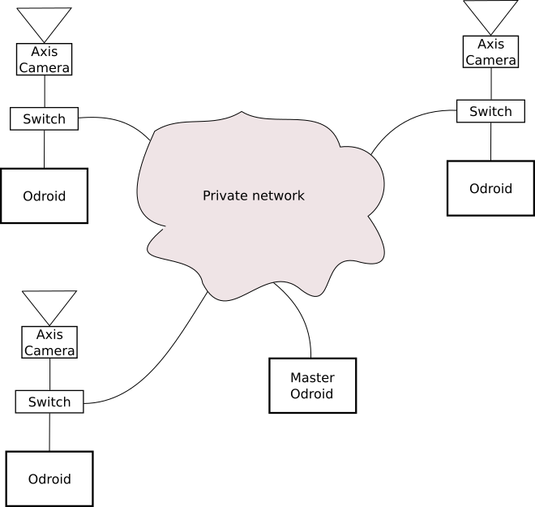

This is a public repository for the production code of the Skimage project.

# Skimage overview

 Skimage is a program that uses a live video stream to count skiers on the ski slopes. It runs on an ARM based single board computer, the [Odroid XU4Q](https://wiki.odroid.com/odroid-xu4/odroid-xu4). The Odroids are deployed in the field physically nearby the network cameras ([Axis M2025-LE](https://www.axis.com/en-us/products/axis-m2025-le)), connected by a network switch. This network switch is then connected to the local network of the ski station. The network camera and the Odroid both have fixed IP addresses on the local network, and may be accessed independently. This configuration is shown schematically below.



The Odroid treats the live video stream from the associated camera, which means there is typically no video streaming traffic on the larger network. Logs of counted skiers are recorded and passed on to the client periodically.

Each Odroid-switch-camera unit is independent, and the system may contain an arbitrary number *N* of these units. The system contains an extra Odroid, labeled in the diagram as *Master Odroid*, for a total of *N*+1 Odroids. All of the Odroids in the system are equivalent: they all have the same software installed, and they all contain the same Skimage files. The only difference between them is the [Utilities/my_id.txt](Utilities/my_id.txt) file. For the Master Odroid this file contains the string "master". For all the other Odroids this file contains the last three digits of their IP address. 

The Master Odroid plays two important roles in the system:

1. **Deployment:**
   
   The Master Odroid handles the [deployment procedure](#deployment-procedure) described below. The Odroids need the right to communicate with each other via SSH on the private network, but the private network may be completely isolated from the wider internet. This allows us to, for example, unplug the Master Odroid from the private network, modify and test changes *on a system perfectly equivalent to the system deployed in the field*, then reconnect the Master Odroid to the private network and propagate the modifications in the manner described below.

2. **Monitoring:** 
   
   All of the Odroids are equivalent, so we can use the Master Odroid to monitor the performance of any Odroid on the system. For example, if we want to monitor the performance of Odroid 212, we simply change the [Utilities/my_id.txt](Utilities/my_id.txt) file on the Master Odroid from **master** to **212** and start Skimage. The video stream will continue to be processed by the Odroid 212, but now the Master Odroid will also be reading the same video stream and processing it *with the same parameters as Odroid 212*. On the Master Odroid we can turn on the graphic display, ensure that everything is performing correctly, change the parameters, etc., all without disrupting Odroid 212. If we make changes to the parameter file that we wish to propagate, we simple follow the [deployment procedure](#deployment-procedure) for update the parameter file on all Odroids.

### Prerequisites
The following are the necessary components of Skimage:

1. An Odroid version of Ubuntu 18.04:
    This is the operating system that ships with the Odroid, and has some adaptations for the GPU drivers, among other things.
2. The inotify-tools package, which allows efficient monitoring of files and folders. This is the only external prerequisite not bundled into the docker image.
3. Docker: The docker engine and docker-compose
4. The [Docker image for Skimage](https://cloud.docker.com/repository/docker/a2ps/skimage)
5. [This source code repository](https://github.com/A2PhotonicSensors/skimage_edge_production)

## Skimage usage 

Once Skimage is installed it runs as  a systemd service on startup. If we want to start it manually, we simply run [skimage.sh](skimage.sh) from the command line. For example:
```bash
cd /home/odroid/skimage_edge_production
./skimage.sh
```
This will shutdown any running instances of Skimage on the system and restart Skimage. For more technical details, see the [developer documentation](https://github.com/nstelzen/skimage_edge).

In order to maximize efficiency Skimage has no graphics output by default. To verify the status of the running instance of Skimage the follow commands are useful:

To verify the status of the default instance of Skimage that starts automatically as a systemd process:
```bash
sudo systemctl status skimage_watchdog.service
```

To examine the logs:
```bash
docker logs -f skimage
docker logs -f watchdog
```

Or by examining the program logs found in the folder Logs_program
## Skimage parameters

The parameter for Skimage are contained in two files: [Utilities/skimage_variables.env](Utilities/skimage_variables.env) and [data/skimage_parameters.xlsx](data/skimage_parameters.xlsx)


[Utilities/skimage_variables.env](Utilities/skimage_variables.env) contains basic system information mostly useful for the deployment of Skimage. The contents shouldn't change much, if at all. Note that these parameters are valid for all of the Odroids.


[data/skimage_parameters.xlsx](data/skimage_parameters.xlsx) is the principle location of the Skimage parameters. This file is a spreadsheet, in which each row sets the parameters for a specific Odroid in the system. Each column contains a parameter used by Skimage. Many of these parameters are common to all Odroids, but some must be set manually for each individual Odroid in the system. The following is a brief description of the parameters that must be individually set.

* **Sensor_Label:** A label of the location at which the Odroid and camera are deployed
* **Camera_Path:** The full path, including login and password to the live video feed
* **Odroid_Path:** The IP address of the Odroid
* **ROI:** The Region Of Interest is a list of points in normalized image coordinates that defines a subsection of the image in which we are interested. 
* **CUT_Line1:** This parameter (as well as Cut_Lines 2-4) is a list of points defining a line segment or series of connected line segments in normalized image coordinates. The Skimage log count is defined as the number of skiers that cross this line. Have more than one line allows us to have a more robust count (e. g. preventing under-counting due to occlusions).

The python script [Utilities/ROI_CL_selector.py](Utilities/ROI_CL_selector.py) was developed to allow the selection of the **ROI** and **Cut_Line**'s graphically.


# Deployment

Deployment is handled by the script [deploy_skimage.sh](deploy_skimage.sh)

The deployment script envisages the following 5 uses cases for deployment:
1. **Full installation:**
   This use case is for performing a fresh installation of Skimage and all of the prerequisites of Skimage. This option assumes only that all Odroids on the network have the correct operating system and have access to the internet. All of the dependencies, including the docker engine, docker-compose, the Skimage docker image, etc. are installed, and the Skimage is configure to start automatically after a system reboot. This option may be used to configure all Odroids before deployment in the field. **Attention:** All Skimage data (Logs, etc.) will erased after this option is performed. 

2. **Update Docker image:**
   This use case is for updating the docker image on all the Odroids on the network after a change is made to the docker image. This option assumes that the Odroids on the network are deployed in the field, and do *not* have internet access. The docker image is compressed into a tarball and sent out to all the Odroids on the network. The compressed file is then unpacked and install as an updated Docker image on all of the Odroids. **Note:** This compressed Docker image is a large (~2 Gb) file, and it would be much more efficient to set up a docker image repository on the master Odroid, then have all the Odroids on the network simply use ```docker pull``` to update their local docker image. 

3. **Update all source code:**
   This uses case is for updating the source code folder on all the Odroids on the network (the files in this repository) after a change is made to one or more source code files. This option preserves all local data, such as logs, videos, etc. on Odroid.  

4. **Update parameter file only:**
   This use case is for updating the parameter file [data/skimage_parameters.xlsx](data/skimage_parameters.xlsx) on all the Odroids on the network after a change to the parameter file. While it may seem redundant to force an update to all Odroids even after a small change to the parameter file, the system is designed such that all of the Odroids are functionally similar, and all have the same version of the Skimage code base and parameters. 


5. **Status update:**
   This use case if for reporting on the status of all the Odroids on the network. This option returns a status report that informs the user of any problems on any of the deployed Odroids.

The two principle repositories for Skimage are this github repository and the [Skimage Docker image](https://cloud.docker.com/repository/docker/a2ps/skimage). The deployment script attempts to pull the lastest version of these repositories before updating the rest of the Odroids on the network. If this is not possible, for example
if the Master Odroid is deployed at the Ski station and does not have internet access, the deployment will proceed with the local versions of the files on the Master Odroid. **To avoid confusion, the Skimage repositories at github and dockerhub should be kept updated to be as close to the Master Odroid as possible.** 

In addition to the 5 options outline above, the [deployment script](deploy_skimage.sh) also performs the following tasks on all of the Odroids on the network:

1. Sets the time zone and compares the local date and time with the date and time of the Master Odroid.

2. Creates the [data/my_id.txt](data/my_id.txt) file on the local Odroid, which contains the last three digits of the IP address of the local Odroid. This allows the local Odroid to identify which set of parameters to use from the [parameters file](data/skimage_parameters.xlsx), and provides the ID for the Skimage logs.

3. Creates a link from the Skimage logs folder to a another folder where Infoneige can collect them via FTP. This is provided simply for convenience to Infoniege.

4. Reboot the local Odroid. Skimage is installed as a systemd service that starts automatically on boot. In order to ensure that all of the updates are taken into account the local Odroid is rebooted after each update.    

## Deployment procedure

Follow the following procedure to propagate a source file or docker image modification to all the Odroids on the network: 

1. Verify that the Skimage system parameters (the time zone, file paths, etc.) found in [Utilities/skimage_variables.env](Utilities/skimage_variables.env) are correct.

2. Verify that the parameters file [data/skimage_parameters.xlsx](data/skimage_parameters.xlsx) is up to date, especially the list of IP addresses for the Odroids on the network.
    
3. Push the update to [this repository](https://github.com/A2PhotonicSensors/skimage_edge_production) and/or the [Skimage dockerhub repository](https://cloud.docker.com/repository/docker/a2ps/skimage)

4. From the Master Odroid, pull the latest versions of the above repositories. If an internet connection is not available from the Master Odroid, transfer the source code files and/or the Docker image to the Master Odroid however possible (```scp``` from Infoneige, USB key, etc.).

5. Run [deploy_skimage.sh](deploy_skimage.sh) from the command line on the Master Odroid. 

6. Enter the username and password for the Odroids on the network. All of the Odroids on the network should have the same username and password.

7. Select the deployment option.

8. Run the *Status update* option to see the status of the deployed Odroids after the update. 


